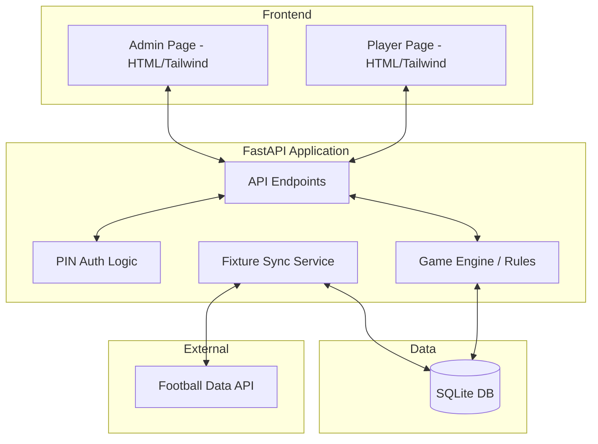

# Last Man Standing - Implementation Plan

## Overview
A simple, modern web application to manage a "Last Man Standing" football betting game.
- **Backend:** Python (FastAPI)
- **Database:** SQLite
- **Frontend:** Single HTML pages (Player/Admin) with Tailwind CSS
- **Deployment:** Single Docker container

## Core Features
### 1. Game Rules Engine
- One pick per gameweek.
- Must pick a winner to stay in.
- Cannot pick the same team twice.
- Deadline: Before the first kick-off of the gameweek.
- Postponed matches: Automatic "through" for the player (team counts as used).
- Everyone out in the same week: Pot is shared.

### 2. Admin Interface
- Create players and assign 5-digit PINs.
- Sync fixtures and results from an external API (e.g., Football-Data.org).
- Manual overrides for edge cases.

### 3. Player Interface
- Login via random 5-digit PIN.
- View status (Active/Eliminated).
- See upcoming fixtures and select a team (filtered by previously used teams).
- View other players' picks **only after the deadline**.
- View current list of active and eliminated players.

---

## Todo List

### Phase 1: Foundation
- [ ] Initialize project structure (FastAPI, SQLite, Docker)
- [ ] Define database schema (User, Gameweek, Fixture, Pick)

### Phase 2: Backend Development
- [ ] PIN-based authentication
- [ ] Admin: User management endpoints
- [ ] Admin: Football API integration for fixtures/results
- [ ] Player: Status and fixture retrieval
- [ ] Player: Pick submission logic (with validation)
- [ ] Automated game resolution (moving to next GW, eliminating losers)

### Phase 3: Frontend Development
- [ ] Player Dashboard (Login, Status, Picking, Standings)
- [ ] Admin Dashboard (Sync triggers, User management)

### Phase 4: Containerization & Testing
- [ ] Dockerfile configuration (serving HTML from FastAPI)
- [ ] End-to-end testing of game rules

---

## Architecture

